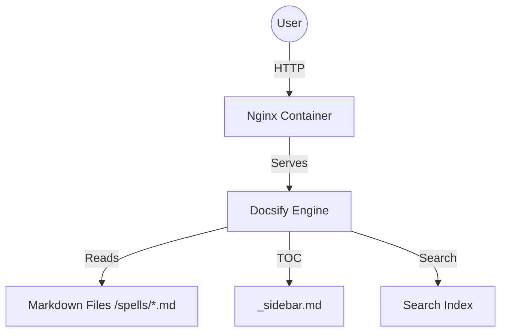

# Spellbook

This repository is a personal collection of technical notes, configurations, and architectural patterns gathered over more than 15 years. It is, in many ways, a testimony of my journey through software engineering, infrastructure and also leadership. Also a **relic** from an era where we manually curated knowledge, a practice that feels different now that AI agents can provide answers in any terminal.

## The History

This project began in the early 2010s, originally living on flash drives alongside portable Windows applications, a different era. And later migrating through Bitbucket and eventually a private GitHub repository. It has been known by various names such as "kb" (Knowledge Base) and "tech-tips" before becoming the Spellbook a few years ago.

The content reflects different eras of my journey:
- The earliest notes cover Linux administration and Git fundamentals.
- Legacy sections (now mostly removed) included Atlassian Bamboo configurations on Windows Server and complex batch scripts for .NET build pipelines.
- More recent content includes personal Linux laptop configuration and AI cli agents usage.

## Important Note on Git History and Security

The Git history of this repository was intentionally purged before making it public. As this project was originally for personal use, early history contained legacy passwords and credentials that are no longer relevant but posed a security risk.

Furthermore:
- Any remaining internal IP addresses, local file paths, and server names remaining in the notes belong to a defunct infrastructure.
- These notes are personal references. Use the commands and configurations with caution and at your own risk. They represent knowledge tested in specific contexts that may have changed over time.

## How to Use

### Using Docker Compose

```bash
docker compose up --build -d
# navigate to http://localhost:81
```

### Using Docker Directly

```bash
docker build -t spellbook:latest .
docker run -d -p 81:3000 --name spellbook spellbook:latest
# navigate to http://localhost:81
```

### Local Development

```bash
sudo apt update
sudo apt install nodejs npm -y
sudo npm install -g docsify-cli@4.4.4
docsify serve .
```

## Maintenance

### Updating Sidebar and Spells Index

If you add new .md files to the root or spells/ directory, run the following command to update the navigation:

```bash
cd tools && go run gen_sidebar.go
```

This script will:
1. Scan for new markdown files.
2. Update _sidebar.md with proper links.
3. Update spells/index.md to keep the spells gallery synchronized.

## Architecture



---
Built with Docsify.
